# Aria

This repository serves as the record for the time I used to learn miscellaneous algorithms.

- **Aria**: Some scenes rendered via WebGL2
- **Anthem**: Some scenes rendered via Vulkan


| Anthem (Vulkan) / Volume Lighting (AD-29)     | Anthem (Vulkan) / Ocean (AD-30)                     |
| --------------------------------------------- | --------------------------------------------------- |
| 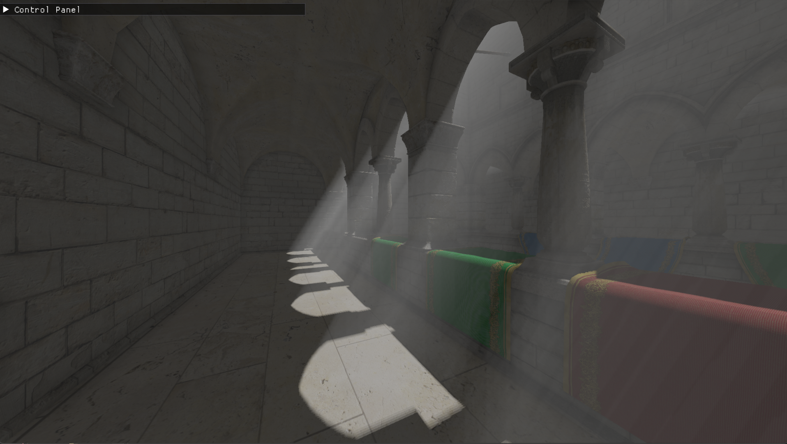                       | 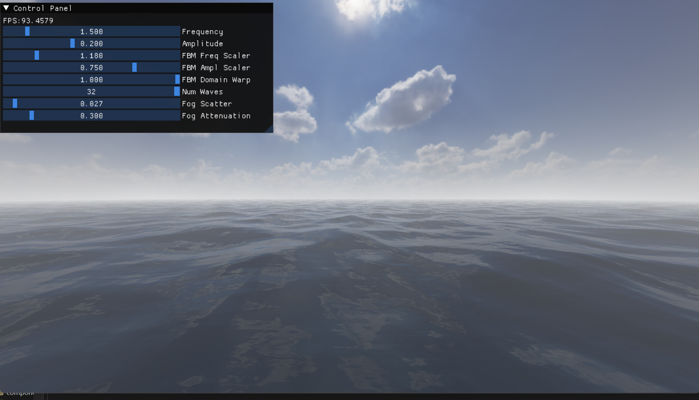                             |
| **Anthem (Vulkan) / Fluid (AD-38)**           | **Anthem (Vulkan) / Hardware Path Tracing (AD-25)** |
| 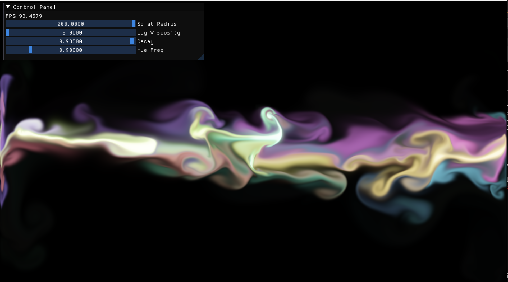                       | 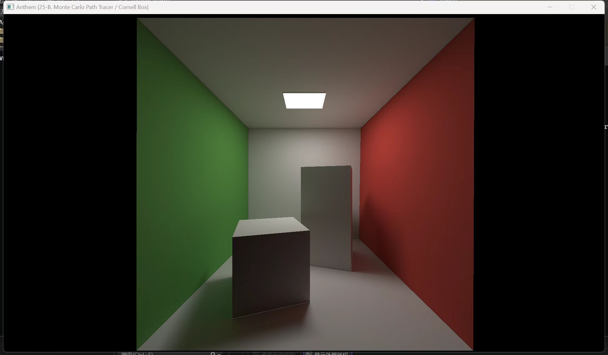                              |
| **Anthem (Vulkan) / HiZ Culling (AD-34)**     | **Aria (WebGL2) / Toon Shader (V1-C6S11)**          |
| 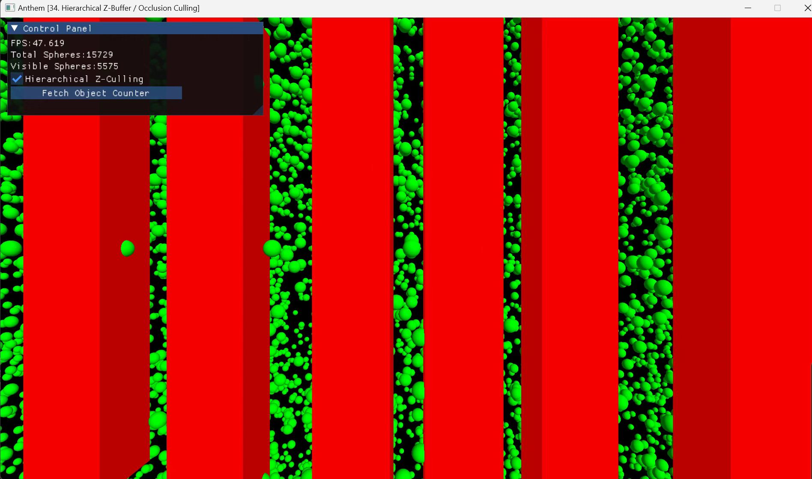                        | 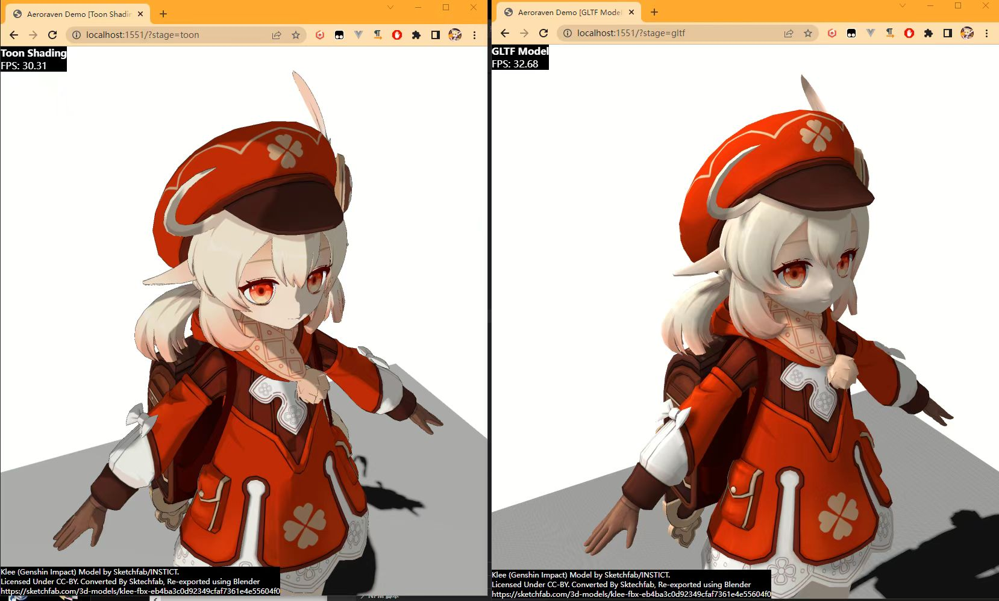                              |
| **Aria (WebGL2) / FXAA (V1-C6S11)**           | **Aria (WebGL2) / Caustics (V1-C6S14)**             |
| 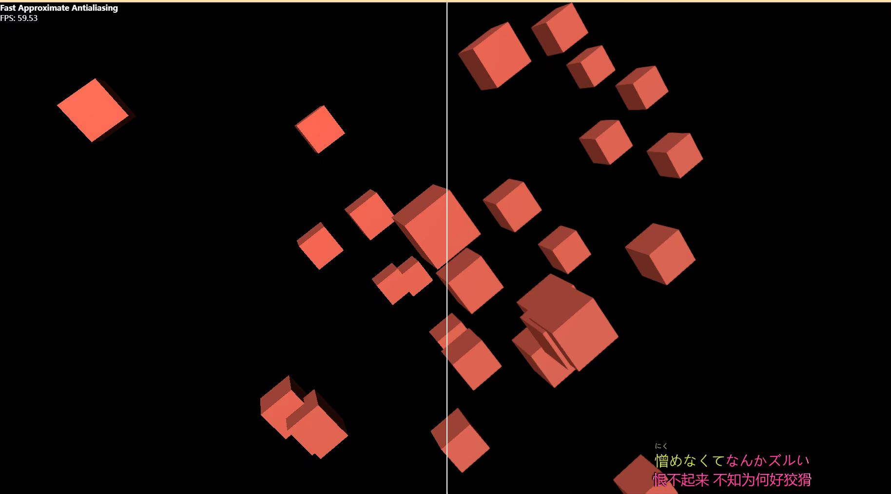                        | 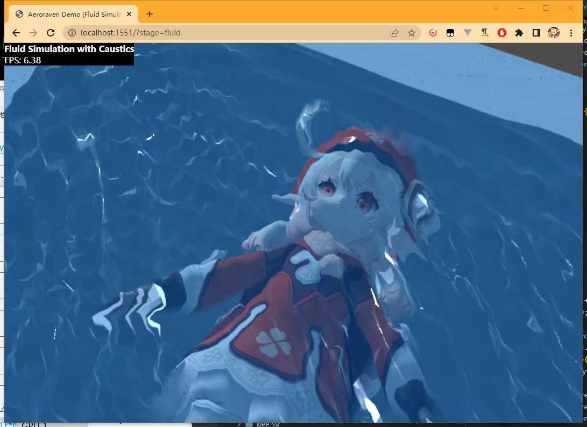                              |
| **Aria (WebGL2) / Volume Lighting (V1-C6S6)** | **Aria (WebGL2) / Mass Spring Cloth (V2-C8S2)**     |
| 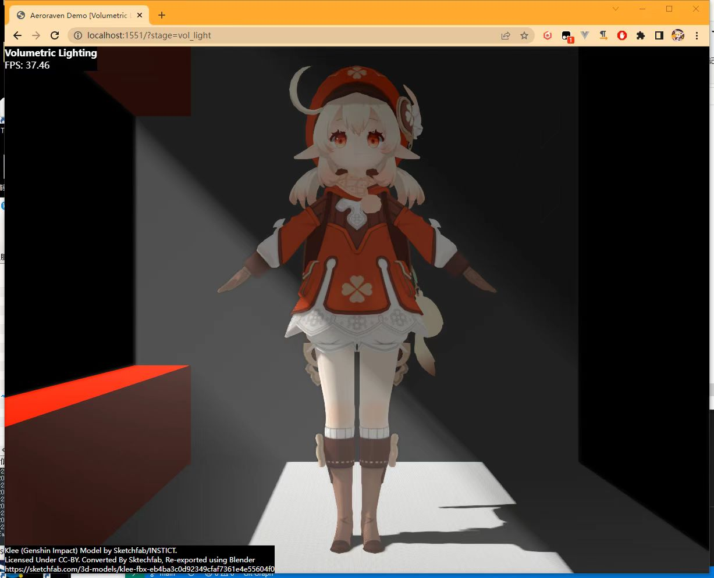                        | 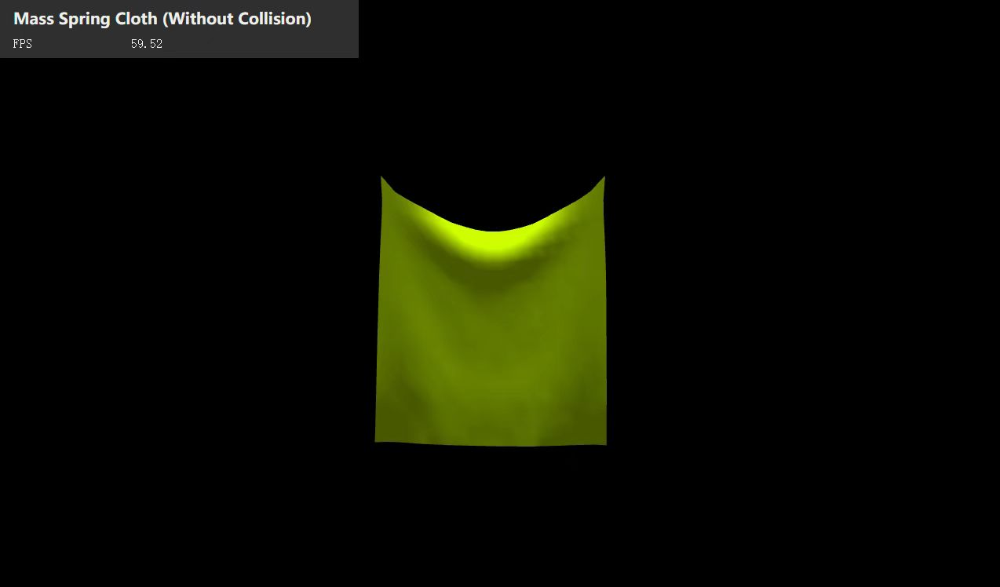                              |
| **Aria (WebGL2) / Voxelization (V1-C7S7)**    | **Aria (WebGL2) / Kawase Blur (V1-C7S2)**           |
| 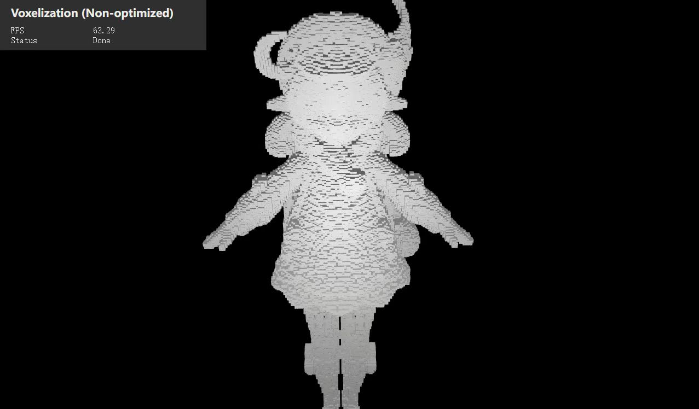                        | 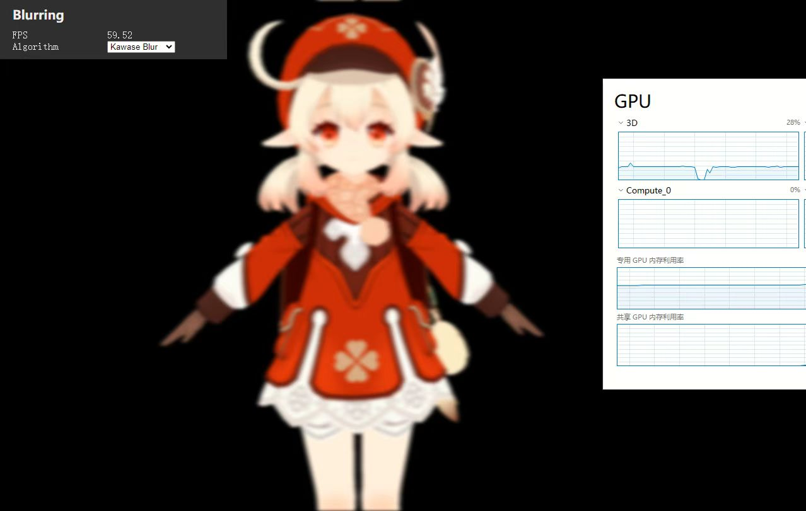                              |


## 0. Clarification

The rectified WebGL ray-tracing is here: https://github.com/Aeroraven/Aria/blob/main/Aria-v2/src/examples/AriaStagePathTracing.ts. 

This implementation corrects https://github.com/Aeroraven/Ray-tracing.


## I. All Demos

Here are all demos implemented in this repository

- `○`: Accessible
- `×`: Not accessible
- `▲`: Incomplete / Incorrect
- `/`: Not supported 
  - Although compute shader can be simulated by pixel shader sometimes


| Stage                                              | Native (Vulkan) | Browser (WebGL2) |
| -------------------------------------------------- | --------------- | ---------------- |
| 1. Triangle                                        | ○ (AD-1)        | ○ (V0-C1S1)      |
| 2. GLTF Model                                      | ○ (AD-2)        | ○ (V1-C6S5)      |
| 3. Spotlight                                       | ×               | ○ (V0-C2S4)      |
| 4. Stencil Testing (Outline Drawing)               | ○ (AD-26)       | ○ (V0-C3S2)      |
| 5. Convolution & Blur                              | ×               | ○ (V0-C3S3)      |
| 6-A. Sky Box (Cubic Texture)                       | ○ (AD-20)       | ○ (V0-C3S4)      |
| 6-B. Environment Mapping                           | ○ (AD-30)       | ○ (V0-C3S4)      |
| 7. Instancing                                      | ○ (AD-11/16/34) | ○ (V0-C3S5)      |
| 8. Blinn-Phong Shading                             | ×               | ○ (V0-C4S1)      |
| 9. Normal Mapping                                  | ○ (AD-29)       | ○ (V0-C4S2)      |
| 10. HDR                                            | ○ (AD-29)       | ○ (V0-C4S3)      |
| 11. PBR Basics                                     | ○ (AD-5)        | ○ (V0-C5S2)      |
| 12-A. Simple Bloom                                 | ×               | ○ (V0-C5S3)      |
| 12-B. Bloom (Mip-chain)                            | ○ (AD-31)       | ▲ (V2-C7S4)      |
| 13-A. Directional Shadow Mapping                   | ○ (AD-8)        | ○ (V0-C5S4)      |
| 13-B. Point Shadow Mapping                         | ○ (AD-21)       | ○ (V2-C7S5)      |
| 14. Noise                                          | ×               | ○ (V1-C6S1)      |
| 15. SSAO                                           | ○ (AD-6)        | ○ (V1-C6S7)      |
| 16. SSR                                            | ○ (AD-9/32)     | ▲ (V1-C6S8)      |
| 17. Mipmap                                         | ○ (AD-1)        | ○ (V2-C7S3)      |
| 18. Toon Shader                                    | ○ (AD-31)       | ○ (V1-C6S11)     |
| 19-A. FXAA                                         | ○ (AD-27-A)     | ○ (V1-C6S4)      |
| 19-B. TAA                                          | ○ (AD-27-B)     | ×                |
| 19-C. MLAA                                         | ○ (AD-27-C)     | ○ (V2-C7S1)      |
| 19-D. SMAA                                         | ×               | ×                |
| 20. Geometry Shader                                | ○ (AD-7)        | /                |
| 21-A. Volumetric Rendering                         | ○ (AD-12)       | ○ (V1-C6S3)      |
| 21-B. Volumetric Lighting / Fog (Ray Marching)     | ×               | ○ (V2-C6S6)      |
| 21-C. Volumetric Lighting / Fog (Voxel)            | ○ (AD-29)       | /                |
| 22. Kawase Blur                                    | ○ (AD-31)       | ○ (V2-C7S2)      |
| 23. Cloth Simulation                               | ○ (AD-15)       | ○ (V2-C8S2)      |
| 24-A. Wave Simulation (Numerical)                  | ×               | ○ (V1-C6S12)     |
| 24-B. Wave Simulation (FBM)                        | ○ (AD-30)       | ×                |
| 24-C. Gerstner Wave                                | ×               | ○ (V1-C6S2)      |
| 25-A. Water Refraction                             | ×               | ▲ (V1-C6S13)     |
| 25-B. Water Caustics                               | ×               | ▲ (V1-C6S14)     |
| 25-D. Water Refraction + Reflection (DuDv Mapping) | ○ (AD-32)       |                  |
| 26. Voxelization                                   | ×               | ▲ (V2-C7S7)      |
| 27-A. Ray Tracing Triangle                         | ○ (AD-24)       | ×                |
| 27-B. Path Tracing (Graphics Pipeline)             | ×               | ○ (V2-C9S1)      |
| 27-C. Path Tracing (Compute Pipeline)              | ○ (AD-14)       | /                |
| 27-D. Path Tracing (Hardware Accelerated)          | ○ (AD-25-B)     | /                |
| 28. Terrain Generation (Tessellation)              | ○ (AD-17)       | ×                |
| 29. OIT                                            | ○ (AD-18)       | ×                |
| 30. Indirect Draw                                  | ○ (AD-13/34)    | /                |
| 31. Mesh Shader                                    | ○ (AD-19)       | /                |
| 32. LTC Area Light                                 | ○ (AD-28)       | ×                |
| 33. Global Fog                                     | ○ (AD-30)       | ×                |
| 34. Marching Cubes (Compute Shader)                | ○ (AD-32)       | /                |
| 35. Procedural Terrain Generation                  | ○ (AD-32)       | ×                |
| 36. Cascaded Shadow Mapping                        | ○ (AD-32)       | ×                |
| 37. Frustum Culling (Compute Shader)               | ○ (AD-32/34)    | /                |
| 38. Fluid Dynamics Simulation / Stam Method        | ○ (AD-33)       | ×                |
| 39. Hierarchical Z-Buffer / Occlusion Culling      | ○ (AD-34)       | ×                |
| 40. Parallel N-Way Radix Sort                      | ○ (AD-35)       | /                |


## II. Running Instruction

Almost all assets are not contained in this repository. To ensure that the app runs, please download resources (including models, textures, etc)


### 1. Native Examples

#### Prerequisites / Dependencies

- GPU Memory >= 4 GB
- MSVC >= 19.34 + CMake >= 3.10
- Vulkan >= 1.3
  - With Ray Tracing Pipeline Extension Support. [See Supported GPU List](https://vulkan.gpuinfo.org/listdevicescoverage.php?extension=VK_KHR_ray_tracing_pipeline&platform=windows)
  - With Mesh Shader Support. [See Supported GPU List](https://vulkan.gpuinfo.org/listdevicescoverage.php?extension=VK_EXT_mesh_shader&platform=windows)
- glfw3
- freetype2
- OpenCV

#### Instructions

Native examples use Vulkan as backend. Use following instruction to build the project. `$SELECTED_TARGETS` can be chosen from `demo` subdirectory.

Download assets (models, textures, etc.) before running the demo.

NOTE: Change paths in CMake configuration file before the compilation! (I am too lazy to make them compatible with different envs). Ensure that your device supports `Vulkan 1.3` and `Ray Tracing Extension`

```bash
cd Anthem
cmake -S . -B ./build
cmake --build ./build --config Debug --target $SELECTED_TARGETS
```

Edit `CMakeLists.txt` before changing compiler.

**Note:** Running the code in `WSL` is not recommended!


### 2. Browser-based Examples

Browser-based examples uses WebGL as backend. Install node dependencies before running this project. After installation, run the project.
```bash
cd Aria-v2
npm install --force
npm run deploy
```

(WebGPU might be considered later)


### 3. Engine-based Examples

Based on Unity 3D. Refer to files inside `Asylum` folder. 


## III. Acknowledgement & License

### License & Disclaimer

This repository is licensed under AGPL-3.0 License. Referenced models and textures are excluded.

Licenses for referenced models and textures coincide with the license of original repository they belong to, or the license their author determined.


### Acknowledgements & References

Please refer to [acknowledgement.md](./acknowledgement.md) for more details.
